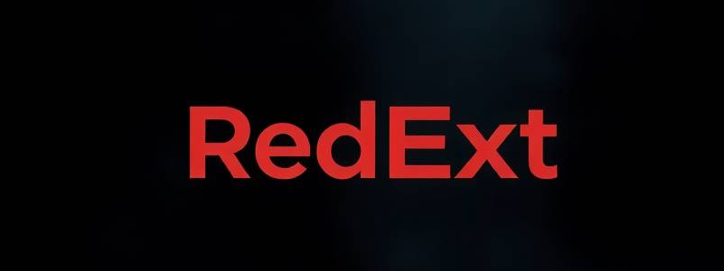
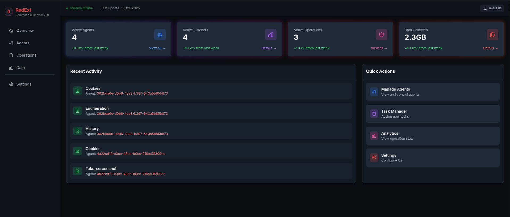

<div align="center">
  
  
  <p>Browser extension-based Command & Control framework</p>

  [](https://www.python.org/)
  [](https://flask.palletsprojects.com/)
  [](https://www.sqlite.org/)
  [](https://developer.chrome.com/docs/extensions/mv3/)
  [](https://redext-wiki.netlify.app/)
</div>

## Overview

RedExt is a sophisticated browser data analysis framework designed for authorized red team operations. It combines a Manifest V3 Chrome extension with a Flask-based C2 server to provide comprehensive browser data collection and analysis capabilities through a modern dark-themed dashboard.

> 📚 **Documentation**: Visit our [RedExt Wiki](https://redext-wiki.netlify.app/) for comprehensive guides and API references.



## Features

- **Cookie Extraction**
  - Domain-specific filtering
  - Automatic cookie organization by domain
  - Captures all cookie attributes
  - Supports secure and httpOnly cookies

- **Browsing History Data**
  - Configurable date range for history collection
  - Includes visit frequency analytics
  - Captures page titles and timestamps
  - Tracks manual URL entries vs. link clicks

- **Screenshot Capture**
  - Full page capture
  - Viewport snapshots
  - Element-specific captures

- **Clipboard Capture**
  - Real-time clipboard monitoring
  - Multiple content format support
  - Source URL tracking
  - Timestamp logging

- **DOM Snapshot**
  - Complete DOM tree capture
  - Includes dynamic content
  - Resource dependency tracking
  - State preservation

   **Local Storage Capture**
  - Complete localStorage extraction
  - JSON-formatted output
  - Domain context preservation
  - Real-time data capture

- **System Reconnaissance**
  - Browser environment profiling
  - Extension enumeration
  - Hardware capability assessment
  - Network configuration analysis
  - GPU information gathering

- **Bookmarks Collection**
  - Bookmark folder structure
  - Complete bookmark hierarchy extraction
  - Preserves folder structure
  - Includes creation timestamps
  - Captures bookmark metadata

## Installation

### Server Setup
```bash
# Clone repository
git clone https://github.com/Darkrain2009/redext.git
cd redext/server

# Create virtual environment
python3 -m venv venv
source venv/bin/activate  # Linux/Mac
# or
.\venv\Scripts\activate   # Windows

# Install dependencies
pip3 install -r requirements.txt

# Initialize database
python3 db_setup.py

# Launch server
python3 c2_server.py runserver
```

### Extension Setup

#### GUI Installation
1. Open Chrome/Firefox
2. Navigate to Extensions page (`chrome://extensions`)
3. Enable "Developer mode"
4. Click "Load unpacked"
5. Select the `ext` directory from the repository

#### Command Line Installation (Chrome)
```bash
# Linux
google-chrome --load-extension=/path/to/redext/ext

# macOS
/Applications/Google\ Chrome.app/Contents/MacOS/Google\ Chrome --load-extension=/path/to/redext/ext

# Windows (PowerShell)
& 'C:\Program Files\Google\Chrome\Application\chrome.exe' --load-extension=C:\path\to\redext\ext

# Windows (CMD)
"C:\Program Files\Google\Chrome\Application\chrome.exe" --load-extension=C:\path\to\redext\ext
```

## Usage

### Task Management
1. Access the dashboard
2. Select target agent
3. Create new task
4. Configure parameters
5. Deploy and monitor

### Result Analysis
- Access the dashboard
- Filter by data type


## Security Considerations

⚠️ **IMPORTANT**: This tool is designed for authorized operations only.

## Technical Architecture

### Server Component
- **Framework**: Flask 2.2.5
- **Database**: SQLite3
- **API**: RESTful JSON endpoints

### Extension Structure
- **Manifest**: Version 3
- **Background**: Service Worker
- **Content Scripts**: DOM interaction

## Documentation

Visit our [Wiki](https://redext-wiki.netlify.app/) for:
- Installation Guide
- Development Guide
- Use Cases

## Contributing

I Am welcome contributions!

## License

This project is licensed under the MIT License - see [LICENSE](LICENSE) for details.

## Acknowledgments

- Inspired by modern red team operations
- Built with security research in mind

## Author

Feel Free to reach me on [Twiter](https://x.com/darkrain2009)

---
